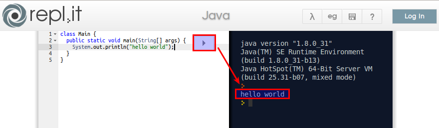

.. _sec-intro:

=====
Intro
=====

.. todo:: 

   Intro here

The first coding in less than 10 seconds: http://repl.it/languages/Java

You should see something like this:

.. todo::

   make clear how the user can improve this document

.. note::
   disclaimer: I'm not an English native speaker. If you find typos or grammer 
   mistakes, please open an issue at https://github.com/mzoellerGit/edu/issues